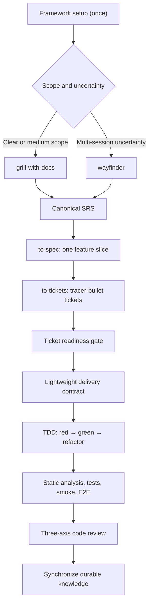

# AI Skills Framework — Development Plan

**Status:** Proposed
**Created:** 2026-07-22
**Product name:** AI Skills Framework
**Machine identifier:** `ai-skills-framework`
**Brand:** Minic
**Purpose:** Record the agreed direction and phased delivery plan before skills, rules, or package infrastructure are generated.

## Goal

Create AI Skills Framework, an installable, maintainable, and versioned Minic agent skill framework for Laravel backend development with adaptable TypeScript frontend support.

The framework will:

- Use Matt Pocock's language-agnostic development lifecycle and vocabulary as its backbone.
- Add OpenSPDD's useful risk analysis, safeguards, intent-drift detection, and traceability without adopting its Java/Spring assumptions or batch-generation workflow.
- Prefer vertical tracer-bullet delivery and test-driven development.
- Work with Codex, Cursor, Claude, and other clients supporting the Agent Skills standard.
- Support installation from GitHub with the external `skills` CLI and native plugin packaging where useful.
- Treat the Laravel Boost-generated `AGENTS.md` as protected and never modify it.

## Core artifact ownership

| Artifact | Responsibility |
| --- | --- |
| SRS | Intended system behavior, requirements, constraints, risks, and acceptance criteria |
| Domain glossary | Precise, implementation-independent project terminology |
| ADRs | Rationale for durable architectural decisions |
| Feature spec | One cohesive deliverable slice extracted from the SRS |
| Ticket contract | Constraints, safeguards, seams, dependencies, and verification for one tracer bullet |
| Project guidelines | Repository-specific coding and workflow standards |
| Tests | Executable behavioral evidence |
| Code | Implementation truth |
| Tickets | Delivery sequencing and blocking relationships |

Implementation details must not be synchronized back into the SRS merely because they exist in code. Only durable behavioral, domain, or architectural decisions should update long-lived documentation.

## Target lifecycle



### Discovery and SRS

- Use `grill-with-docs` for clear or medium-sized work.
- Use `wayfinder` only when uncertainty cannot be resolved in one agent context.
- Add an `srs-modeling` skill to create, incrementally update, and audit a comprehensive SRS.
- Record accepted decisions in the correct artifact immediately: SRS, glossary, or ADR.
- Use the Oldwood SRS as a structural reference, while keeping volatile implementation details out of the generic SRS template.

### Specification and ticket decomposition

- `to-spec` extracts one cohesive feature from the SRS.
- `to-spec` incorporates OpenSPDD's useful concept-driven exploration, risk/gap analysis, acceptance-criteria coverage, safeguards, and explicit non-goals.
- `to-tickets` decomposes the feature into independently verifiable vertical tracer bullets with explicit blocking edges.
- A separate mandatory `spdd-analysis` stage is not retained.
- Each ticket must fit into a fresh implementation context and expose a demonstrable or verifiable outcome.

### Ticket delivery contract

Each ticket should contain:

- Linked SRS requirement and acceptance-criteria IDs.
- User-visible outcome.
- Relevant domain concepts.
- Architectural boundary and public testing seam.
- Chosen approach and material tradeoffs.
- Safeguards and invariants.
- Prohibited behavior and explicit non-goals.
- Blocking dependencies.
- Verification matrix.
- Unresolved assumptions.

This replaces a separate REASONS Canvas document. It must not prescribe exhaustive file, class, method, or annotation inventories.

### Implementation

The framework will expose one primary user-facing implementation skill: `implement`.

Its workflow is:

1. Validate ticket readiness.
2. Load linked SRS/spec requirements, safeguards, and project conventions.
3. Confirm the public testing seam.
4. Establish or validate the ticket delivery contract.
5. Implement one vertical behavior at a time using red-green-refactor.
6. Run the configured verification profile.
7. Run code review.
8. Synchronize durable documentation.
9. Commit only when explicitly requested.

OpenSPDD's batch-oriented `spdd-generate` workflow is not retained.

### Verification

Laravel verification may include, according to impact and project configuration:

- Laravel Pint.
- PHPStan/Larastan.
- Targeted Pest tests.
- Affected domain and feature tests.
- Mandatory smoke tests for changed routes or user workflows.
- Broader or full test suites at the delivery gate.
- Pest browser or Playwright tests for affected browser behavior.

JavaScript frontend verification may include:

- Formatter and linter.
- Type checking.
- Unit and component tests.
- Production build.
- E2E tests for affected user behavior.

Exact commands must be discovered during setup and recorded in framework configuration instead of being guessed during each task.

### Review

Code review will evaluate three independent axes:

1. **Standards:** project guidelines, applicable Laravel/JavaScript conventions, and code quality.
2. **Contract:** SRS/spec/ticket compliance, safeguards, scope, omissions, additions, implicit decisions, and direction drift.
3. **Evidence:** whether the selected checks and tests prove the acceptance criteria.

### Selective synchronization

After successful implementation and review:

- Update the SRS only for deliberate externally meaningful behavior or constraint changes.
- Update the glossary when domain terminology changes.
- Add or supersede ADRs when durable architectural decisions change.
- Update ticket state, evidence, and project history as required.
- Do not synchronize private methods, file paths, package internals, annotations, or incidental implementation choices.

## Proposed core skills

### Explicitly invoked

- `framework-setup`
- `framework-router`
- `grill-with-docs`
- `wayfinder`
- `srs-modeling`
- `to-spec`
- `to-tickets`
- `implement`

### Supporting/model-invoked

- `domain-modeling`
- `codebase-design`
- `tdd`
- `verify-change`
- `code-review`
- `diagnosing-bugs`

The primary lifecycle will not contain standalone `spdd-analysis`, `spdd-reasons-canvas`, `spdd-generate`, or `spdd-sync` skills.

## Preserved language-agnostic vocabulary

Matt Pocock's established vocabulary and architecture concepts should be retained:

- Module, Interface, Implementation, and Depth.
- Seam, Adapter, Leverage, and Locality.
- Tracer bullet and vertical slice.
- Frontier, blocking edge, destination, and fog.
- Public testing seams.
- Domain glossary and ADR discipline.

## Repository structure

```text
/
├── skills/                         # Flat, released skills only
├── experimental/                   # Outside automatic discovery
├── deprecated/
├── schemas/
├── fixtures/
│   ├── laravel-livewire/
│   ├── laravel-react-typescript/
│   └── laravel-svelte-typescript/
├── evals/
├── scripts/
├── .codex-plugin/
├── .claude-plugin/
├── .agents/plugins/
├── .changeset/
├── package.json
├── CHANGELOG.md
├── LICENSE
└── UPSTREAM.md
```

Runtime references, scripts, and assets must remain co-located with the skill that owns them. Released skills should be flat under `skills/`; experimental and deprecated skills should not be accidentally discovered or installed.

## Installation and distribution

Initial universal installation:

```bash
npx skills@latest add OWNER/REPOSITORY
```

A custom npm installer is not required for the first release. The npm `skills` command is an external installer that discovers skills in a GitHub repository.

Additional distribution:

- Agent Skills-compatible skill directories for broad client support.
- A native Codex plugin and marketplace entry.
- A Claude plugin and marketplace entry.
- Cursor and other supported clients installed through the universal skills CLI.

The package should use semantic versions and Changesets. CI must keep package, plugin, and marketplace versions synchronized.

## Framework configuration

The setup skill should create or update an explicit, machine-readable configuration such as `.agent-framework.yaml`, after presenting detected values for confirmation.

It should record:

- SRS path.
- Glossary and ADR paths.
- Project guideline and convention paths.
- Backend and frontend profiles.
- Issue-tracker adapter.
- Verification commands.
- Documentation/history policy.

Framework defaults must yield to applicable project instructions and conventions.

## Existing project documents

- `AGENTS.md` is generated by Laravel Boost and must remain untouched.
- `project-guidelines.md` remains the personal/project guideline source.
- `docs/conventions/` remains project-specific guidance discovered by setup.
- `Oldwood SRS.en.md` is a structural SRS example.
- `docs/development-routine-and-order.md` represents the previous OpenSPDD-heavy lifecycle and should be migrated only after this plan is approved.
- Oldwood-specific inventory, audit, and RBAC rules must not become universal Laravel defaults.

## Delivery phases

### Phase 1 — Provenance and package foundation

#### Work

- Fork Matt Pocock's repository while preserving Git history.
- Record the exact upstream commit.
- Preserve MIT license and copyright notices for adapted Matt and OpenSPDD material.
- Flatten released skills under `skills/`.
- Add Changesets, semantic tags, changelog generation, and one authoritative version.
- Add CI validation for skill metadata, links, manifests, and version consistency.
- Add installation smoke tests for Codex, Claude, and Cursor.

#### Success criteria

- The repository installs through `npx skills@latest add OWNER/REPOSITORY`.
- Every released skill passes Agent Skills validation.
- Plugin and package versions cannot drift.
- Upstream provenance is traceable.

#### Current status — 2026-07-22

Completed and published as `v0.1.0`:

- Created and cloned the public `emipac/skills` fork with `origin` and `upstream` remotes.
- Recorded Matt's baseline commit `ed37663cc5fbef691ddfecd080dff42f7e7e350d` and OpenSPDD's analysis baseline in `UPSTREAM.md`.
- Preserved Matt and OpenSPDD MIT attribution in `LICENSE` and `THIRD_PARTY_NOTICES.md`.
- Flattened 22 released skills under `skills/`; moved draft and retired work to `experimental/` and `deprecated/`.
- Applied the AI Skills Framework name, `ai-skills-framework` identifier, Minic brand, and cross-client manifests.
- Made `package.json` version `0.1.0` authoritative and added manifest synchronization.
- Added repository validation for skill metadata, links, manifests, layout, marketplace source, and version parity.
- Added CI validation and isolated universal installation smoke tests for Codex, Claude Code, and Cursor.
- Validated all 22 released skills and the native Codex plugin with the official bundled validators.
- Confirmed the universal skills CLI discovers exactly 22 released skills and installs a representative skill for all three primary clients from the published GitHub source.
- Published commit `cd72a4487af12c15ffbcd2ff8f6ec4d00a2d14fc` and release tag `v0.1.0`; GitHub Validate and Release workflows passed.

### Phase 2 — Preserve Matt's backbone

#### Work

- Import stable language-agnostic skills with minimal behavioral changes.
- Record every intentional divergence from upstream.
- Add `framework-setup` and the lifecycle router.
- Add project discovery and `.agent-framework.yaml`.
- Add local Markdown, GitHub Issues, Jira, and Linear tracker adapters.
- Ensure setup never edits `AGENTS.md`.

#### Success criteria

- Matt's vocabulary and tracer-bullet lifecycle remain recognizable.
- Setup is idempotent.
- Existing repository instructions are discovered and respected.
- An automated test proves `AGENTS.md` remains byte-for-byte unchanged.

#### Current status — 2026-07-22

Implemented locally for `0.2.0`:

- Preserved the 20 unchanged supporting skills and their language-agnostic vocabulary.
- Renamed `ask-matt` to `framework-router` while retaining its main flow, on-ramps, wayfinder branch, tracer bullets, TDD, and review sequence.
- Replaced prompt-only `setup-matt-pocock-skills` with deterministic `framework-setup` and `.agent-framework.yaml` schema version 1.
- Added discovery for Laravel, Livewire, React with TypeScript, Svelte with TypeScript, SRS/glossary/ADR paths, project instructions, history policy, and existing verification commands.
- Added local Markdown, GitHub Issues, Jira, and Linear tracker adapters.
- Added unit tests proving setup idempotency, explicit unresolved values, all four adapters, and byte-for-byte protection of every discovered `AGENTS.md`.
- Recorded every material divergence from Matt's baseline in `UPSTREAM.md`.
- Completed repository validation, all released-skill validators, unit tests, dependency audit, native Codex plugin validation, and isolated Codex, Claude Code, and Cursor installation smoke tests.

Remaining before publication:

- Review, commit, and push the Phase 2 changes when explicitly authorized.
- Merge the Changesets version pull request to publish `0.2.0` at the agreed release point.

### Phase 3 — SRS lifecycle

#### Work

- Extract a generic SRS template from the useful structure of the Oldwood SRS.
- Build `srs-modeling`.
- Integrate SRS maintenance with `grill-with-docs` and `wayfinder`.
- Add stable requirement IDs, acceptance-criteria IDs, safeguards, risks, and open-question tracking.
- Add SRS creation, refinement, and audit evaluations.

#### Success criteria

- A new project can create a complete SRS.
- An existing SRS can be refined without rewriting unrelated sections.
- Every accepted decision is stored in the correct artifact.
- Open questions and missing acceptance coverage remain visible.

### Phase 4 — Planning and delivery contracts

#### Work

- Extend `to-spec` with risk/gap analysis, traceability, safeguards, and test-seam decisions.
- Extend `to-tickets` with delivery contracts, blocker graphs, and readiness gates.
- Build the single `implement` orchestrator.
- Replace REASONS generation with vertical red-green-refactor delivery.
- Allow implementation learning to update a contract through an explicit decision rather than silently drifting.

#### Success criteria

- SRS requirements trace to feature specs and tickets.
- Tickets are vertical, independently verifiable, and sized for one context.
- No ticket begins with unresolved blocking assumptions.
- Implementation produces red-before-green evidence at the agreed seam.

### Phase 5 — Verification and review

#### Work

- Add Laravel and TypeScript frontend verification profiles.
- Add deterministic command and capability discovery.
- Add targeted-to-broad verification ordering.
- Extend code review with contract drift, safeguards, scope, and evidence.
- Add selective SRS, glossary, ADR, ticket, and history synchronization.

#### Success criteria

- Verification reports exact commands, outcomes, and intentionally skipped layers.
- User-facing changes receive smoke or browser coverage.
- Code review reports Standards, Contract, and Evidence findings separately.
- Incidental implementation details do not pollute durable documentation.

### Phase 6 — Compatibility and pilot release

#### Work

- Validate behavior in Codex, Cursor, Claude, Copilot, and OpenCode.
- Exercise Laravel-only, Livewire, React with TypeScript, and Svelte with TypeScript fixtures.
- Run end-to-end lifecycle evaluations from ambiguous request through reviewed implementation.
- Publish `0.1.0`.
- Pilot the framework on one real feature.
- Stabilize artifact schemas and invocation behavior before `1.0.0`.

#### Success criteria

- Installation and core lifecycle work in the target clients.
- The same project conventions and safeguards survive client changes.
- Pilot feedback is recorded as explicit framework changes.
- Version `1.0.0` is not released until artifact contracts are stable.

## Release policy

### Before 1.0.0

- Publish one milestone minor for each completed framework phase.
- Batch compatible fixes into a weekly patch release when changes exist.
- Release broken-installation, security, or destructive-behavior fixes immediately.
- Keep one Changesets release pull request open and merge it only at the planned release point.
- Require a Changeset for every user-visible or contract-affecting change.

Planned milestone versions:

| Version | Scope |
| --- | --- |
| `0.1.0` | Package foundation |
| `0.2.0` | Matt's backbone and project setup |
| `0.3.0` | SRS lifecycle |
| `0.4.0` | Specifications, tickets, and implementation |
| `0.5.0` | Verification and review |
| `0.6.0` | Cross-client compatibility and pilot |
| `0.7.x`–`0.9.x` | Stabilization and real-project feedback |
| `1.0.0-rc.1` | Feature freeze and final validation |
| `1.0.0` | Stable public contract |

### After 1.0.0

- Publish compatible minor releases on a two-week train when changes are ready.
- Publish patches weekly or immediately for urgent defects.
- Publish major releases only for approved incompatible contract changes, never on a calendar.
- Do not publish empty releases.

Version meanings:

- Patch: backward-compatible fixes, wording corrections, and evaluation improvements.
- Minor: compatible skills, profiles, tracker adapters, or optional schema fields.
- Major: removed or renamed skills, required configuration changes, incompatible artifact schemas, or lifecycle-contract changes.

### 1.0.0 promotion criteria

All of the following must be true:

- Core skill names, responsibilities, invocation behavior, and lifecycle boundaries are finalized.
- Configuration and artifact schemas are versioned, documented, and stable for four weeks.
- The end-to-end lifecycle works from setup through durable synchronization.
- Local Markdown, GitHub, Jira, and Linear adapters pass their contract tests.
- Livewire, React with TypeScript, and Svelte with TypeScript fixtures pass.
- Installation and the core lifecycle are verified in Codex, Claude, Cursor, Copilot, and OpenCode.
- Setup is idempotent and leaves `AGENTS.md` byte-for-byte unchanged.
- No workflow commits, pushes, or rewrites durable documentation without explicit authorization.
- At least three real features have completed the lifecycle across at least two Laravel projects.
- At least two release candidates pass under feature freeze for a minimum of two weeks.
- No critical or high-severity defect, broken primary-client installation, version drift, missing provenance, or undocumented breaking change remains.

## Confirmed decisions

- Use the formal `emipac/skills` fork of Matt Pocock's repository.
- Use **AI Skills Framework** as the product/package name and `ai-skills-framework` as its machine identifier.
- Use **Minic** as the brand.
- Support local Markdown, GitHub Issues, Jira, and Linear as first-class tracker adapters.
- Support one canonical SRS entry document with optional linked modules.
- Target Laravel Livewire, TypeScript with React, and TypeScript with Svelte without creating separate lifecycle skills for each frontend.
- Never commit automatically unless explicitly requested.
- Use the release cadence and `1.0.0` promotion criteria defined above.
