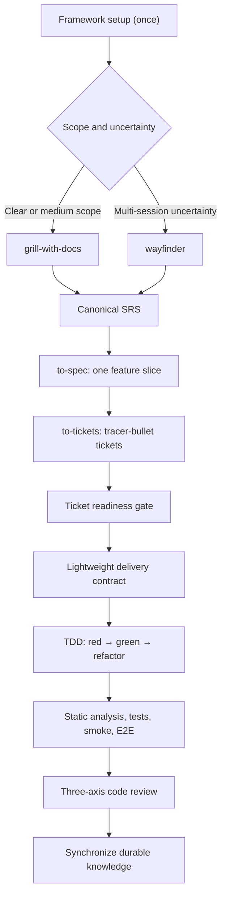

# AI Skills Framework — Development Plan

**Status:** In progress — Phase 6
**Created:** 2026-07-22
**Product name:** AI Skills Framework
**Machine identifier:** `ai-skills-framework`
**Brand:** Minic
**Purpose:** Record the agreed direction and phased delivery plan before skills, rules, or package infrastructure are generated.

## Goal

Create AI Skills Framework, an installable, maintainable, and versioned Minic agent skill framework for Laravel or Express with TypeScript backend development and adaptable Livewire or TypeScript frontend support.

The framework will:

- Use Matt Pocock's language-agnostic development lifecycle and vocabulary as its backbone.
- Add OpenSPDD's useful risk analysis, safeguards, intent-drift detection, and traceability without adopting its Java/Spring assumptions or batch-generation workflow.
- Prefer vertical tracer-bullet delivery and test-driven development.
- Work with Codex, Cursor, Claude, and other clients supporting the Agent Skills standard.
- Support installation from GitHub with the external `skills` CLI and native plugin packaging where useful.
- Treat the Laravel Boost-generated `AGENTS.md` as protected and never modify it.

## Core artifact ownership

| Artifact | Responsibility |
| --- | --- |
| SRS | Intended system behavior, requirements, constraints, risks, and acceptance criteria |
| Domain glossary | Precise, implementation-independent project terminology |
| ADRs | Rationale for durable architectural decisions |
| Feature spec | One cohesive deliverable slice extracted from the SRS |
| Ticket contract | Constraints, safeguards, seams, dependencies, and verification for one tracer bullet |
| Project guidelines | Repository-specific coding and workflow standards |
| Tests | Executable behavioral evidence |
| Code | Implementation truth |
| Tickets | Delivery sequencing and blocking relationships |

Implementation details must not be synchronized back into the SRS merely because they exist in code. Only durable behavioral, domain, or architectural decisions should update long-lived documentation.

## Target lifecycle



### Discovery and SRS

- Use `grill-with-docs` for clear or medium-sized work.
- Use `wayfinder` only when uncertainty cannot be resolved in one agent context.
- Add an `srs-modeling` skill to create, incrementally update, and audit a comprehensive SRS.
- Record accepted decisions in the correct artifact immediately: SRS, glossary, or ADR.
- Use the Oldwood SRS as a structural reference, while keeping volatile implementation details out of the generic SRS template.

### Specification and ticket decomposition

- `to-spec` extracts one cohesive feature from the SRS.
- `to-spec` incorporates OpenSPDD's useful concept-driven exploration, risk/gap analysis, acceptance-criteria coverage, safeguards, and explicit non-goals.
- `to-tickets` decomposes the feature into independently verifiable vertical tracer bullets with explicit blocking edges.
- A separate mandatory `spdd-analysis` stage is not retained.
- Each ticket must fit into a fresh implementation context and expose a demonstrable or verifiable outcome.

### Ticket delivery contract

Each ticket should contain:

- Linked SRS requirement and acceptance-criteria IDs.
- User-visible outcome.
- Relevant domain concepts.
- Architectural boundary and public testing seam.
- Chosen approach and material tradeoffs.
- Safeguards and invariants.
- Prohibited behavior and explicit non-goals.
- Blocking dependencies.
- Verification matrix.
- Unresolved assumptions.

This replaces a separate REASONS Canvas document. It must not prescribe exhaustive file, class, method, or annotation inventories.

### Implementation

The framework will expose one primary user-facing implementation skill: `implement`.

Its workflow is:

1. Validate ticket readiness.
2. Load linked SRS/spec requirements, safeguards, and project conventions.
3. Confirm the public testing seam.
4. Establish or validate the ticket delivery contract.
5. Implement one vertical behavior at a time using red-green-refactor.
6. Run the configured verification profile.
7. Run code review.
8. Synchronize durable documentation.
9. Commit only when explicitly requested.

OpenSPDD's batch-oriented `spdd-generate` workflow is not retained.

### Verification

Laravel verification may include, according to impact and project configuration:

- Laravel Pint.
- PHPStan/Larastan.
- Targeted Pest tests.
- Affected domain and feature tests.
- Mandatory smoke tests for changed routes or user workflows.
- Broader or full test suites at the delivery gate.
- Pest browser or Playwright tests for affected browser behavior.

JavaScript frontend verification may include:

- Formatter and linter.
- Type checking.
- Unit and component tests.
- Production build.
- E2E tests for affected user behavior.

Exact commands must be discovered during setup and recorded in framework configuration instead of being guessed during each task.

### Review

Code review will evaluate three independent axes:

1. **Standards:** project guidelines, applicable Laravel/JavaScript conventions, and code quality.
2. **Contract:** SRS/spec/ticket compliance, safeguards, scope, omissions, additions, implicit decisions, and direction drift.
3. **Evidence:** whether the selected checks and tests prove the acceptance criteria.

### Selective synchronization

After successful implementation and review:

- Update the SRS only for deliberate externally meaningful behavior or constraint changes.
- Update the glossary when domain terminology changes.
- Add or supersede ADRs when durable architectural decisions change.
- Update ticket state, evidence, and project history as required.
- Do not synchronize private methods, file paths, package internals, annotations, or incidental implementation choices.

## Proposed core skills

### Explicitly invoked

- `framework-setup`
- `framework-router`
- `grill-with-docs`
- `wayfinder`
- `srs-modeling`
- `to-spec`
- `to-tickets`
- `implement`

### Supporting/model-invoked

- `domain-modeling`
- `codebase-design`
- `tdd`
- `verify-change`
- `code-review`
- `diagnosing-bugs`

The primary lifecycle will not contain standalone `spdd-analysis`, `spdd-reasons-canvas`, `spdd-generate`, or `spdd-sync` skills.

## Preserved language-agnostic vocabulary

Matt Pocock's established vocabulary and architecture concepts should be retained:

- Module, Interface, Implementation, and Depth.
- Seam, Adapter, Leverage, and Locality.
- Tracer bullet and vertical slice.
- Frontier, blocking edge, destination, and fog.
- Public testing seams.
- Domain glossary and ADR discipline.

## Repository structure

```text
/
├── skills/                         # Flat, released skills only
├── experimental/                   # Outside automatic discovery
├── deprecated/
├── schemas/
├── fixtures/
│   ├── laravel-livewire/
│   ├── laravel-react-typescript/
│   └── laravel-svelte-typescript/
├── evals/
├── scripts/
├── .codex-plugin/
├── .claude-plugin/
├── .agents/plugins/
├── .changeset/
├── package.json
├── CHANGELOG.md
├── LICENSE
└── UPSTREAM.md
```

Runtime references, scripts, and assets must remain co-located with the skill that owns them. Released skills should be flat under `skills/`; experimental and deprecated skills should not be accidentally discovered or installed.

## Installation and distribution

Initial universal installation:

```bash
npx skills@latest add OWNER/REPOSITORY
```

A custom npm installer is not required for the first release. The npm `skills` command is an external installer that discovers skills in a GitHub repository.

Additional distribution:

- Agent Skills-compatible skill directories for broad client support.
- A native Codex plugin and marketplace entry.
- A Claude plugin and marketplace entry.
- Cursor and other supported clients installed through the universal skills CLI.

The package should use semantic versions and Changesets. CI must keep package, plugin, and marketplace versions synchronized.

## Framework configuration

The setup skill should create or update an explicit, machine-readable configuration such as `.agent-framework.yaml`, after presenting detected values for confirmation.

It should record:

- SRS path.
- Glossary and ADR paths.
- Project guideline and convention paths.
- Backend and frontend profiles.
- Issue-tracker adapter.
- Verification profile, capabilities, and exact commands.
- Documentation/history policy.

Framework defaults must yield to applicable project instructions and conventions.

## Existing project documents

- `AGENTS.md` is generated by Laravel Boost and must remain untouched.
- `project-guidelines.md` remains the personal/project guideline source.
- `docs/conventions/` remains project-specific guidance discovered by setup.
- `Oldwood SRS.en.md` is a structural SRS example.
- `docs/development-routine-and-order.md` represents the previous OpenSPDD-heavy lifecycle and should be migrated only after this plan is approved.
- Oldwood-specific inventory, audit, and RBAC rules must not become universal Laravel defaults.

## Delivery phases

### Phase 1 — Provenance and package foundation

#### Work

- Fork Matt Pocock's repository while preserving Git history.
- Record the exact upstream commit.
- Preserve MIT license and copyright notices for adapted Matt and OpenSPDD material.
- Flatten released skills under `skills/`.
- Add Changesets, semantic tags, changelog generation, and one authoritative version.
- Add CI validation for skill metadata, links, manifests, and version consistency.
- Add installation smoke tests for Codex, Claude, and Cursor.

#### Success criteria

- The repository installs through `npx skills@latest add OWNER/REPOSITORY`.
- Every released skill passes Agent Skills validation.
- Plugin and package versions cannot drift.
- Upstream provenance is traceable.

#### Current status — 2026-07-22

Completed and published as `v0.1.0`:

- Created and cloned the public `emipac/skills` fork with `origin` and `upstream` remotes.
- Recorded Matt's baseline commit `ed37663cc5fbef691ddfecd080dff42f7e7e350d` and OpenSPDD's analysis baseline in `UPSTREAM.md`.
- Preserved Matt and OpenSPDD MIT attribution in `LICENSE` and `THIRD_PARTY_NOTICES.md`.
- Flattened 22 released skills under `skills/`; moved draft and retired work to `experimental/` and `deprecated/`.
- Applied the AI Skills Framework name, `ai-skills-framework` identifier, Minic brand, and cross-client manifests.
- Made `package.json` version `0.1.0` authoritative and added manifest synchronization.
- Added repository validation for skill metadata, links, manifests, layout, marketplace source, and version parity.
- Added CI validation and isolated universal installation smoke tests for Codex, Claude Code, and Cursor.
- Validated all 22 released skills and the native Codex plugin with the official bundled validators.
- Confirmed the universal skills CLI discovers exactly 22 released skills and installs a representative skill for all three primary clients from the published GitHub source.
- Published commit `cd72a4487af12c15ffbcd2ff8f6ec4d00a2d14fc` and release tag `v0.1.0`; GitHub Validate and Release workflows passed.

### Phase 2 — Preserve Matt's backbone

#### Work

- Import stable language-agnostic skills with minimal behavioral changes.
- Record every intentional divergence from upstream.
- Add `framework-setup` and the lifecycle router.
- Add project discovery and `.agent-framework.yaml`.
- Add local Markdown, GitHub Issues, Jira, and Linear tracker adapters.
- Ensure setup never edits `AGENTS.md`.

#### Success criteria

- Matt's vocabulary and tracer-bullet lifecycle remain recognizable.
- Setup is idempotent.
- Existing repository instructions are discovered and respected.
- An automated test proves `AGENTS.md` remains byte-for-byte unchanged.

#### Current status — 2026-07-22

Completed and published as `v0.2.0`:

- Preserved the 20 unchanged supporting skills and their language-agnostic vocabulary.
- Renamed `ask-matt` to `framework-router` while retaining its main flow, on-ramps, wayfinder branch, tracer bullets, TDD, and review sequence.
- Replaced prompt-only `setup-matt-pocock-skills` with deterministic `framework-setup` and `.agent-framework.yaml` schema version 1.
- Added discovery for Laravel, Livewire, React with TypeScript, Svelte with TypeScript, SRS/glossary/ADR paths, project instructions, history policy, and existing verification commands.
- Added local Markdown, GitHub Issues, Jira, and Linear tracker adapters.
- Added unit tests proving setup idempotency, explicit unresolved values, all four adapters, and byte-for-byte protection of every discovered `AGENTS.md`.
- Recorded every material divergence from Matt's baseline in `UPSTREAM.md`.
- Completed repository validation, all released-skill validators, unit tests, dependency audit, native Codex plugin validation, and isolated Codex, Claude Code, and Cursor installation smoke tests.
- Published implementation commit `84019d754c38478c0334d3b579ffc1302fcf7962`; the Validate workflow passed.
- Manually opened and merged [version pull request #1](https://github.com/emipac/skills/pull/1) after repository Actions permissions blocked automatic PR creation.
- Published [release `v0.2.0`](https://github.com/emipac/skills/releases/tag/v0.2.0) before committing Phase 3, preserving distinct milestone versions.

### Phase 3 — SRS lifecycle

#### Work

- Extract a generic SRS template from the useful structure of the Oldwood SRS.
- Build `srs-modeling`.
- Integrate SRS maintenance with `grill-with-docs` and `wayfinder`.
- Add stable requirement IDs, acceptance-criteria IDs, safeguards, risks, and open-question tracking.
- Add SRS creation, refinement, and audit evaluations.

#### Success criteria

- A new project can create a complete SRS.
- An existing SRS can be refined without rewriting unrelated sections.
- Every accepted decision is stored in the correct artifact.
- Open questions and missing acceptance coverage remain visible.

#### Current status — 2026-07-22

Completed and published as `v0.3.0`:

- Extracted a generic SRS contract and template from Oldwood's useful product, scope, requirement, role, scenario, non-functional, risk, question, and acceptance structure.
- Excluded Oldwood-specific physical schema, Filament menu, file, class, and method inventories from the generic baseline.
- Added `srs-modeling` creation, surgical refinement, and audit branches with explicit artifact ownership and readiness gates.
- Added stable FR, NFR, SG, AC, RISK, and Q identifiers, retirement rules, acceptance coverage, safeguard references, and visible unresolved-question tracking.
- Added a read-only deterministic SRS auditor, 9 SRS lifecycle tests, and creation/refinement/audit evaluation cases.
- Integrated SRS maintenance with `grill-with-docs`, `wayfinder`, and `framework-router`.
- Completed 17 unit tests, repository validation for 23 released skills and 89 Markdown files, official validation of all 23 skills, native Codex plugin validation, dependency audit, and isolated Codex, Claude Code, and Cursor installation smoke tests.
- Merged [Phase 3 pull request #2](https://github.com/emipac/skills/pull/2), then merged [version pull request #3](https://github.com/emipac/skills/pull/3).
- Published [release `v0.3.0`](https://github.com/emipac/skills/releases/tag/v0.3.0).

### Phase 4 — Planning and delivery contracts

#### Work

- Extend `to-spec` with risk/gap analysis, traceability, safeguards, and test-seam decisions.
- Extend `to-tickets` with delivery contracts, blocker graphs, and readiness gates.
- Build the single `implement` orchestrator.
- Replace REASONS generation with vertical red-green-refactor delivery.
- Allow implementation learning to update a contract through an explicit decision rather than silently drifting.

#### Success criteria

- SRS requirements trace to feature specs and tickets.
- Tickets are vertical, independently verifiable, and sized for one context.
- No ticket begins with unresolved blocking assumptions.
- Implementation produces red-before-green evidence at the agreed seam.

#### Current status — 2026-07-22

Completed and published as `v0.4.0`:

- Replaced the loose PRD with a feature contract that traces SRS requirements, acceptance criteria, safeguards, risks, questions, public seams, non-goals, and analysis gaps.
- Added deterministic feature-contract auditing for missing sections, unknown SRS references, incomplete acceptance detail, blocking gaps, placeholders, and readiness.
- Extended tracer-bullet tickets into delivery contracts carrying outcomes, domain concepts, tradeoffs, boundaries, seams, safeguards, prohibited behavior, acceptance evidence, verification, blockers, and assumptions; temporary `TB-NNN` draft keys map to canonical tracker IDs after publication.
- Added deterministic delivery-contract and blocker-graph auditing for unknown references, missing evidence, unresolved start-blocking assumptions, unknown/self blockers, and cycles.
- Expanded `implement` into the only implementation orchestrator with readiness refusal, vertical red-green evidence, explicit contract amendments, configured verification, review, and explicit commit/push authorization.
- Added creation and failure-mode evaluations for feature synthesis, ticket decomposition, wide refactors, readiness refusal, red-green delivery, and implementation learning.
- Completed 26 unit and contract tests, repository validation for 23 released skills and 95 Markdown files, official validation of all 23 skills, native Codex plugin validation, dependency audit, and isolated Codex, Claude Code, and Cursor installation smoke tests.
- Merged [Phase 4 pull request #4](https://github.com/emipac/skills/pull/4), then merged [version pull request #5](https://github.com/emipac/skills/pull/5).
- Published [release `v0.4.0`](https://github.com/emipac/skills/releases/tag/v0.4.0); Validate and Release workflows passed.

### Phase 5 — Verification and review

#### Work

- Add Laravel and TypeScript frontend verification profiles.
- Add deterministic command and capability discovery.
- Add targeted-to-broad verification ordering.
- Extend code review with contract drift, safeguards, scope, and evidence.
- Add selective SRS, glossary, ADR, ticket, and history synchronization.

#### Success criteria

- Verification reports exact commands, outcomes, and intentionally skipped layers.
- User-facing changes receive smoke or browser coverage.
- Code review reports Standards, Contract, and Evidence findings separately.
- Incidental implementation details do not pollute durable documentation.

#### Current status — 2026-07-22

Completed and published as `v0.5.0`:

- Evolved `.agent-framework.yaml` to schema version 2 with stack-specific verification profiles, explicit capabilities, and lockfile-selected package-manager commands.
- Added model-invoked `verify-change` with deterministic impact classification, focused-to-broad evidence ordering, required smoke or browser coverage for user-facing work, and exact-command evidence auditing.
- Added Laravel, Livewire, React/TypeScript, and Svelte/TypeScript verification guidance without creating separate lifecycle skills.
- Extended delivery-contract verification matrices with required columns, explicit applicability, user-facing evidence, and frontend build expectations.
- Extended `code-review` from two axes to independent Standards, Contract, and Evidence passes covering safeguards, scope, implicit decisions, intent drift, and verification sufficiency.
- Added selective synchronization ownership for SRS behavior, glossary terms, ADR rationale, tracker evidence, and history while excluding private implementation details.
- Added verification and review evaluations, deterministic planner tests, setup schema tests, and cross-client installation coverage.
- Completed 39 unit and contract tests, repository validation for 24 released skills and 104 Markdown files, official validation of all 24 skills, native Codex plugin validation, dependency audit, and isolated Codex, Claude Code, and Cursor installation smoke tests.
- Merged [Phase 5 pull request #6](https://github.com/emipac/skills/pull/6), then merged [version pull request #7](https://github.com/emipac/skills/pull/7).
- Published [release `v0.5.0`](https://github.com/emipac/skills/releases/tag/v0.5.0); Validate and Release workflows passed.

### Phase 6 — Express/TypeScript compatibility and pilot

#### Destination

Publish `v0.6.0` with first-class Express/TypeScript backend support, preserved Laravel behavior, deterministic backend/frontend scope selection, cross-client compatibility evidence, and one real-feature pilot.

#### Supported baseline

- Backend profiles: `laravel`, `express-typescript`, and conservative `unknown`.
- Frontend profiles: `livewire` with Laravel, React with TypeScript, Svelte with TypeScript, `none`, and conservative `unknown`.
- Express-only and Express with React/TypeScript or Svelte/TypeScript are supported in a single repository.
- npm, pnpm, Yarn, and Bun remain supported through the detected lockfile and repository scripts.
- Workspace repositories are supported only through explicit root scripts and confirmed source scopes; automatic per-workspace command discovery is deferred.
- Express support extends the existing lifecycle and supporting disciplines; it does not add another implementation orchestrator or duplicate Laravel skills.

#### Configuration contract

- Evolve `.agent-framework.yaml` to schema version 3.
- Add `express-typescript` to backend discovery when `express`, TypeScript, and a TypeScript configuration are proved to exist; plain JavaScript Express remains `unknown`.
- Detect Express-only projects as `frontend: none`; retain React/TypeScript and Svelte/TypeScript detection when either frontend is present.
- Add confirmed `source_scopes` for backend, frontend, and shared roots. Use longest-root matching; shared or unmatched paths conservatively affect both scopes.
- Scope each verification command as backend, frontend, or both while preserving exact command order within each evidence stage.
- Read schema version 2 configurations for compatibility, but require `framework-setup` to confirm source and command scopes before rewriting them as schema version 3.
- Preserve setup idempotency, explicit unresolved values, tracker adapters, managed-file boundaries, and byte-for-byte protection of every discovered `AGENTS.md`.

#### Express/TypeScript verification

- Add one Express/TypeScript verification reference covering formatter, linter, TypeScript checking, focused tests, affected tests, HTTP/API smoke evidence, production build when configured, E2E evidence when applicable, and broad tests.
- Discover only proved package scripts and installed capabilities; missing required checks remain visible gaps and never become guessed commands.
- Replace extension-only impact classification with configured source scopes so backend `.ts` files are not treated as frontend files.
- Treat API routes and externally observable HTTP responses as user-facing. They require configured HTTP integration or smoke evidence, but not browser evidence unless a browser workflow is affected.
- Require a frontend production build only when the frontend scope changes; require an Express build only when the delivery contract or configured backend profile makes it applicable.
- Keep the evidence ladder and audit language-agnostic: focused behavior, format, static analysis, affected tests, smoke, build, browser/E2E, then broad tests.

#### Lifecycle integration

- Update `framework-setup`, `framework-router`, `verify-change`, `implement`, and `code-review` to consume the selected backend profile and source scopes.
- Keep SRS, feature-contract, delivery-contract, safeguard, amendment, TDD, and durable-synchronization formats shared between Laravel and Express.
- Make review select applicable Laravel or Express/TypeScript standards while retaining the same independent Standards, Contract, and Evidence axes.
- Update product documentation, examples, metadata, and evaluations without introducing framework-specific glossary terms into the language-agnostic backbone.

#### Fixtures and evaluations

- Add minimal fixtures for Express/TypeScript only, Express with React/TypeScript, and Express with Svelte/TypeScript.
- Add negative fixtures for plain JavaScript Express, ambiguous source roots, missing TypeScript checks, missing API smoke evidence, and unsupported workspace layouts.
- Add regression fixtures for Laravel-only, Livewire, Laravel with React/TypeScript, and Laravel with Svelte/TypeScript.
- Test discovery, schema migration, idempotency, source-scope matching, command scoping, verification ordering, evidence auditing, and unchanged `AGENTS.md` bytes.
- Run an end-to-end lifecycle evaluation from an ambiguous Express feature request through SRS traceability, feature and ticket contracts, red-green implementation evidence, verification, and three-axis review.

#### Delivery order

1. **Configuration contract:** schema version 3, source scopes, scoped commands, and migration rules.
2. **Setup discovery:** Express/TypeScript detection, frontend separation, confirmation flow, and idempotent generation.
3. **Verification planner:** profile-aware impact classification, API evidence, builds, and scoped command selection.
4. **Lifecycle guidance:** Express reference plus router, implementation, and review integration.
5. **Fixtures and regression suite:** Express matrices, failure modes, and complete Laravel regression coverage.
6. **Client compatibility:** install and invoke the core lifecycle in Codex, Cursor, Claude Code, Copilot, and OpenCode where their supported extension mechanisms allow it.
7. **Pilot and release:** deliver one real Express/TypeScript tracer bullet, record feedback as explicit framework changes, add a Changeset, and publish `v0.6.0`.

Each numbered slice blocks the next. Configuration and verification changes must be complete before documentation claims Express support.

#### Success criteria

- Express/TypeScript-only setup selects `backend: express-typescript` and `frontend: none` without manual YAML editing.
- Express with React/TypeScript or Svelte/TypeScript records distinct, confirmed backend and frontend source scopes.
- An Express backend `.ts` change does not trigger a frontend build, while an affected frontend change does.
- API changes require and report exact focused, static, test, and HTTP smoke evidence according to the delivery contract.
- Missing TypeScript, smoke, build, or test capabilities surface as explicit readiness or verification gaps.
- Schema version 2 migration is deterministic and the second schema version 3 setup run is byte-identical.
- All existing Laravel discovery, verification, review, installation, and protection tests continue to pass unchanged in behavior.
- Installation and the core lifecycle work in each target client with client-specific limitations documented.
- The Express pilot completes one vertical red-green tracer bullet with clean Standards, Contract, and Evidence review.
- `v0.6.0` is not published until the full repository validation, official skill validation, plugin validation, dependency audit, installation smoke tests, fixture matrix, and pilot evidence pass.

#### Safeguards and out of scope

- Never modify generated `AGENTS.md` or project instruction files.
- Never infer Express support from TypeScript alone or invent verification commands.
- Never classify all `.js` or `.ts` files as frontend solely by extension.
- Never fork the lifecycle into separate Laravel and Express skill sets.
- Do not add plain JavaScript Express, Fastify, NestJS, automatic per-workspace discovery, application scaffolding, dependency installation, or deployment automation in Phase 6.

#### Current status — 2026-07-23

Implemented locally for `0.6.0`:

- Added the `express-typescript` backend profile and schema version 3 with confirmed backend, frontend, and shared source roots.
- Added deterministic discovery for Express/TypeScript-only, React/TypeScript, and Svelte/TypeScript layouts, including the `server` backend and `src` frontend convention.
- Added backend, frontend, and both command scopes with explicit package-script overrides and package-manager-correct commands.
- Replaced extension-only impact decisions with longest-root matching and visible shared, ambiguous, and unmatched scope notes.
- Added Express API verification requirements, missing TypeScript/test gaps, HTTP smoke semantics, and Express-specific Standards guidance without adding lifecycle skills.
- Added Express-only, Express/React, Express/Svelte, and plain JavaScript negative fixtures plus schema migration, idempotency, unsafe-root, command-scope, verification, and regression tests.
- Extended isolated core-skill installation coverage to Codex, Claude Code, Cursor, GitHub Copilot, and OpenCode.
- Added the `0.6.0` Changeset and documented the project/client compatibility matrix.

Remaining before publication:

- Run one real Express/TypeScript tracer-bullet pilot and record its Standards, Contract, and Evidence results.
- Confirm actual lifecycle invocation in each available target client; automated installation is already proved for all five.
- Run official skill and native plugin validators where their CLIs are allowed.
- Review, commit, push, and open the Phase 6 pull request only when explicitly authorized.

## Release policy

### Before 1.0.0

- Publish one milestone minor for each completed framework phase.
- Batch compatible fixes into a weekly patch release when changes exist.
- Release broken-installation, security, or destructive-behavior fixes immediately.
- Keep one Changesets release pull request open and merge it only at the planned release point.
- Require a Changeset for every user-visible or contract-affecting change.

Planned milestone versions:

| Version | Scope |
| --- | --- |
| `0.1.0` | Package foundation |
| `0.2.0` | Matt's backbone and project setup |
| `0.3.0` | SRS lifecycle |
| `0.4.0` | Specifications, tickets, and implementation |
| `0.5.0` | Verification and review |
| `0.6.0` | Cross-client compatibility and pilot |
| `0.7.x`–`0.9.x` | Stabilization and real-project feedback |
| `1.0.0-rc.1` | Feature freeze and final validation |
| `1.0.0` | Stable public contract |

### After 1.0.0

- Publish compatible minor releases on a two-week train when changes are ready.
- Publish patches weekly or immediately for urgent defects.
- Publish major releases only for approved incompatible contract changes, never on a calendar.
- Do not publish empty releases.

Version meanings:

- Patch: backward-compatible fixes, wording corrections, and evaluation improvements.
- Minor: compatible skills, profiles, tracker adapters, or optional schema fields.
- Major: removed or renamed skills, required configuration changes, incompatible artifact schemas, or lifecycle-contract changes.

### 1.0.0 promotion criteria

All of the following must be true:

- Core skill names, responsibilities, invocation behavior, and lifecycle boundaries are finalized.
- Configuration and artifact schemas are versioned, documented, and stable for four weeks.
- The end-to-end lifecycle works from setup through durable synchronization.
- Local Markdown, GitHub, Jira, and Linear adapters pass their contract tests.
- Livewire, React with TypeScript, and Svelte with TypeScript fixtures pass.
- Installation and the core lifecycle are verified in Codex, Claude, Cursor, Copilot, and OpenCode.
- Setup is idempotent and leaves `AGENTS.md` byte-for-byte unchanged.
- No workflow commits, pushes, or rewrites durable documentation without explicit authorization.
- At least three real features have completed the lifecycle across at least two Laravel projects.
- At least two release candidates pass under feature freeze for a minimum of two weeks.
- No critical or high-severity defect, broken primary-client installation, version drift, missing provenance, or undocumented breaking change remains.

## Confirmed decisions

- Use the formal `emipac/skills` fork of Matt Pocock's repository.
- Use **AI Skills Framework** as the product/package name and `ai-skills-framework` as its machine identifier.
- Use **Minic** as the brand.
- Support local Markdown, GitHub Issues, Jira, and Linear as first-class tracker adapters.
- Support one canonical SRS entry document with optional linked modules.
- Target Laravel Livewire, TypeScript with React, and TypeScript with Svelte without creating separate lifecycle skills for each frontend.
- Never commit automatically unless explicitly requested.
- Use the release cadence and `1.0.0` promotion criteria defined above.
